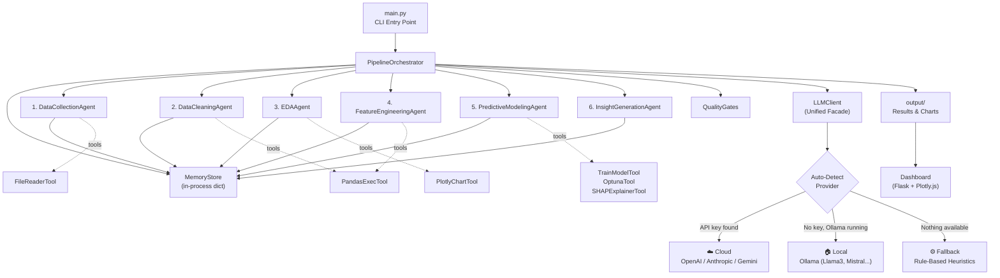

# End-to-End Agentic AI Data Pipeline — Implementation Plan

## Goal

Build a fully functional, end-to-end agentic AI pipeline that takes raw data and autonomously produces cleaned data, exploratory analysis, engineered features, a trained predictive model, and a narrative insight report — all coordinated by an orchestrator agent. The system ships with a sample dataset and a premium web dashboard to visualize results.

---

## User Review Required

> [!NOTE]
> **Dual-Mode LLM — Resolved per your request**: The pipeline now auto-detects available LLM backends. If an API key is found (`OPENAI_API_KEY`, `ANTHROPIC_API_KEY`, or `GOOGLE_API_KEY`), it uses the cloud provider. If no key is set, it automatically falls back to **Ollama** for local model inference (Llama 3, Mistral, Qwen, etc.). You can also force a specific provider via config.

> [!IMPORTANT]
> **Sample Dataset**: I'll generate a synthetic **SaaS customer churn** dataset (~10k rows, 20+ columns) matching the blueprint's example. **Is this acceptable, or do you have a real dataset?**

> [!IMPORTANT]
> **Code Sandbox**: LLM-generated pandas code will execute in a restricted `exec()` environment with a curated whitelist of allowed modules. For production, Docker isolation is recommended but not required for this demo. **Acceptable?**

---

## Proposed Changes

The project follows the directory structure from the blueprint with pragmatic simplifications for a working demo.

### Project Skeleton & Configuration

#### [NEW] [main.py](file:///p:/test/main.py)
- Entry point — loads config, initializes memory, runs orchestrator, launches dashboard
- CLI interface with `argparse` for config overrides

#### [NEW] [requirements.txt](file:///p:/test/requirements.txt)
- All Python dependencies pinned to compatible versions

#### [NEW] [config/pipeline_config.yaml](file:///p:/test/config/pipeline_config.yaml)
- Default pipeline configuration (problem statement, target column, task type, quality gates, human checkpoints)

#### [NEW] [config/quality_gates.yaml](file:///p:/test/config/quality_gates.yaml)
- Per-stage quality thresholds (max missing %, min ROC-AUC, etc.)

#### [NEW] [.env.example](file:///p:/test/.env.example)
- Template for environment variables
- `OPENAI_API_KEY` — optional, enables OpenAI provider
- `ANTHROPIC_API_KEY` — optional, enables Anthropic provider
- `GOOGLE_API_KEY` — optional, enables Gemini provider
- `OLLAMA_BASE_URL` — defaults to `http://localhost:11434`, for local models
- `LLM_PROVIDER` — force a specific provider (`openai`, `anthropic`, `gemini`, `ollama`, `auto`)
- `LLM_MODEL` — override default model name per provider

---

### Core Framework (`core/`)

#### [NEW] [core/__init__.py](file:///p:/test/core/__init__.py)

#### [NEW] [core/llm_client.py](file:///p:/test/core/llm_client.py)
- **Unified facade** — single `LLMClient` class used by all agents
- Methods: `chat()`, `chat_json()`, `plan()`, `generate_code()`, `select()`, `synthesize()`
- All methods accept `messages`, `temperature`, `max_tokens`, `json_schema`
- Delegates to the active provider (see below)
- Built-in retry with exponential backoff, token tracking, cost estimation
- Logs all calls to the agent trace for observability

#### [NEW] [core/llm_providers.py](file:///p:/test/core/llm_providers.py)
- **Provider abstraction layer** — each provider implements `BaseLLMProvider`:

```
BaseLLMProvider (ABC)
  ├── OpenAIProvider      — uses `openai` SDK, models: gpt-4o, gpt-4o-mini
  ├── AnthropicProvider   — uses `anthropic` SDK, models: claude-sonnet-4, claude-haiku
  ├── GeminiProvider      — uses `google-genai` SDK, models: gemini-2.0-flash
  └── OllamaProvider      — uses Ollama REST API (localhost:11434)
                             models: llama3.1, mistral, qwen2.5, codellama, deepseek-coder
```

- **Auto-detection logic** (`detect_provider()`):
  1. Check `LLM_PROVIDER` env var — if set, use that provider
  2. Check for API keys in order: `OPENAI_API_KEY` → `ANTHROPIC_API_KEY` → `GOOGLE_API_KEY`
  3. If any key found → use that cloud provider
  4. If no keys → probe Ollama at `OLLAMA_BASE_URL` (default `localhost:11434`)
  5. If Ollama is running → use `OllamaProvider` with best available model
  6. If nothing available → use `RuleBasedFallback` (no LLM, pure heuristics)

- **OllamaProvider** details:
  - Calls `GET /api/tags` to list locally available models
  - Auto-selects the best model by priority (llama3.1 > mistral > qwen2.5 > any)
  - Uses `POST /api/chat` with OpenAI-compatible message format
  - Supports JSON mode via Ollama's `format: "json"` parameter
  - Handles structured output by injecting JSON schema into the system prompt
  - No API key needed — fully offline capable

- **RuleBasedFallback** — when no LLM is available at all:
  - Returns deterministic, heuristic-based responses for each agent task
  - e.g., cleaning agent uses statistical rules (median imputation, IQR outlier capping)
  - e.g., feature engineering applies standard transforms without LLM reasoning
  - The pipeline still runs end-to-end, just without the "intelligent" decision-making

#### [NEW] [core/models.py](file:///p:/test/core/models.py)
- All Pydantic data models: `DataSource`, `DataProfile`, `CleaningOperation`, `CleaningPlan`, `Finding`, `EDAReport`, `FeatureTransform`, `FeatureStore`, `ModelEvaluation`, `ModelCard`, `Recommendation`, `InsightReport`, `AgentTrace`, `PipelineConfig`, `PipelineResult`
- `LLMConfig` model with fields: `provider`, `model`, `temperature`, `max_tokens`, `base_url`

#### [NEW] [core/sandbox.py](file:///p:/test/core/sandbox.py)
- `safe_exec()` — executes LLM-generated pandas/numpy code in a restricted namespace
- Whitelist of allowed modules, timeout enforcement, output capture
- Prevents `import os`, `import subprocess`, file I/O, network access

---

### Memory & State (`memory/`)

#### [NEW] [memory/__init__.py](file:///p:/test/memory/__init__.py)
#### [NEW] [memory/memory_store.py](file:///p:/test/memory/memory_store.py)
- `MemoryStore` class with in-process dict backend (no Redis dependency for demo)
- Versioned key-value store with timestamps
- `store()`, `retrieve()`, `snapshot()`, `list_keys()` methods
- Lineage tracking via `networkx` directed graph

---

### Tool Registry (`tools/`)

#### [NEW] [tools/__init__.py](file:///p:/test/tools/__init__.py)
#### [NEW] [tools/registry.py](file:///p:/test/tools/registry.py)
- Central tool registry with `@tool` decorator for registration
- Tools: `file_reader`, `pandas_exec`, `plot_chart`, `compute_stats`, `train_model`, `shap_explain`

#### [NEW] [tools/data_tools.py](file:///p:/test/tools/data_tools.py)
- `FileReaderTool` — reads CSV, Parquet, JSON, Excel
- `PandasExecTool` — sandboxed pandas code execution
- `ComputeStatsTool` — descriptive stats, correlation, distribution tests

#### [NEW] [tools/ml_tools.py](file:///p:/test/tools/ml_tools.py)
- `TrainModelTool` — trains sklearn/xgboost/lightgbm models
- `OptunaTool` — Bayesian hyperparameter search
- `SHAPExplainerTool` — SHAP value computation

#### [NEW] [tools/viz_tools.py](file:///p:/test/tools/viz_tools.py)
- `PlotlyChartTool` — generates interactive Plotly charts, saves as HTML/JSON
- `SeabornPlotTool` — generates static matplotlib/seaborn plots, saves as PNG

---

### Agents (`agents/`)

Each agent inherits from `BaseAgent` and follows the ReAct pattern.

#### [NEW] [agents/__init__.py](file:///p:/test/agents/__init__.py)
#### [NEW] [agents/base_agent.py](file:///p:/test/agents/base_agent.py)
- `BaseAgent` with `run()`, `execute_tool()`, `log()`, `should_replan()`
- Reasoning trace collection, telemetry emission
- LLM-assisted planning and replanning loop
- Max-iteration guard (default: 20 steps)

#### [NEW] [agents/data_collection_agent.py](file:///p:/test/agents/data_collection_agent.py)
- Reads from file sources (CSV/Parquet/JSON/Excel) — the demo's primary path
- Schema inference via pandas + LLM commentary
- Validation rule generation and execution
- Outputs: `raw_dataset` + per-source schemas in memory

#### [NEW] [agents/data_cleaning_agent.py](file:///p:/test/agents/data_cleaning_agent.py)
- Generates a `DataProfile` (missing %, cardinality, outliers, duplicates, type info)
- LLM generates a prioritized `CleaningPlan` with justifications
- Executes each `CleaningOperation` via sandboxed pandas code
- Before/after diffing, full change log
- Outputs: `clean_dataset` + `cleaning_log` in memory

#### [NEW] [agents/eda_agent.py](file:///p:/test/agents/eda_agent.py)
- Univariate analysis (distribution, skewness, kurtosis per column)
- Bivariate analysis (correlation with target)
- Correlation matrix with high-correlation detection
- Auto-generates Plotly visualizations (histograms, scatter, heatmap, box plots)
- LLM synthesizes narrative + generates hypotheses
- Outputs: `eda_report` in memory

#### [NEW] [agents/feature_engineering_agent.py](file:///p:/test/agents/feature_engineering_agent.py)
- LLM proposes transforms based on EDA findings (log, interaction, temporal, binning)
- Applies transforms via sandboxed code
- Multi-method feature selection (mutual information + correlation filtering + LLM tie-breaker)
- Feature importance scoring
- Outputs: `feature_store` with lineage in memory

#### [NEW] [agents/modeling_agent.py](file:///p:/test/agents/modeling_agent.py)
- LLM recommends candidate models based on data characteristics
- Cross-validated training of all candidates
- Optuna hyperparameter optimization on best candidate
- Full evaluation metrics (accuracy, ROC-AUC, F1, precision, recall, confusion matrix for classification; RMSE, MAE, R², MAPE for regression)
- SHAP explainability
- Model card generation
- Outputs: `model_result` in memory

#### [NEW] [agents/insight_agent.py](file:///p:/test/agents/insight_agent.py)
- Synthesizes all pipeline outputs into structured insight report
- Executive summary, data quality section, pattern analysis, model interpretation
- Actionable recommendations with confidence scores and evidence
- Next steps suggestions
- Outputs: `insight_report` in memory

---

### Orchestrator (`orchestrator/`)

#### [NEW] [orchestrator/__init__.py](file:///p:/test/orchestrator/__init__.py)
#### [NEW] [orchestrator/pipeline_orchestrator.py](file:///p:/test/orchestrator/pipeline_orchestrator.py)
- `PipelineOrchestrator` runs all 6 stages sequentially
- Retry logic with LLM-suggested hints (max 3 retries per stage)
- Quality gate validation between stages
- Human-in-the-loop checkpoint support (configurable per stage)
- Full pipeline telemetry and cost tracking
- Emits `PipelineResult` with all stage outputs

#### [NEW] [orchestrator/quality_gates.py](file:///p:/test/orchestrator/quality_gates.py)
- Loads quality gate config from YAML
- Validates stage outputs against thresholds
- Returns pass/fail with specific violation details

---

### Sample Data

#### [NEW] [data/generate_sample_data.py](file:///p:/test/data/generate_sample_data.py)
- Generates a synthetic SaaS customer churn dataset (~10k rows)
- Columns: customer_id, signup_date, tenure_days, plan_type, monthly_charges, total_charges, num_support_tickets, avg_response_time_hrs, login_frequency, feature_usage_score, contract_type, payment_method, region, age, gender, num_products, has_partner, has_dependents, online_security, tech_support, churned_30d (target)
- Includes realistic patterns: correlations, missing values, outliers, categorical inconsistencies
- Saves to `data/sample_churn_data.csv`

#### [NEW] [data/sample_churn_data.csv](file:///p:/test/data/sample_churn_data.csv)
- Auto-generated by `generate_sample_data.py`

---

### Web Dashboard

#### [NEW] [dashboard/app.py](file:///p:/test/dashboard/app.py)
- Flask-based web server serving a single-page dashboard
- Reads pipeline results from `output/` directory
- Serves the HTML dashboard + Plotly chart JSON files

#### [NEW] [dashboard/templates/index.html](file:///p:/test/dashboard/templates/index.html)
- Premium dark-themed dashboard with glassmorphism cards
- Sections: Executive Summary, Data Quality, EDA Visualizations (embedded Plotly), Feature Importance, Model Performance, Recommendations
- Responsive layout, smooth animations, Inter font
- All charts rendered via Plotly.js (interactive)

#### [NEW] [dashboard/static/style.css](file:///p:/test/dashboard/static/style.css)
- Full CSS design system: dark theme, glass cards, gradients, micro-animations

---

### Output Directory

#### [NEW] output/
- All pipeline artifacts saved here:
  - `output/pipeline_result.json` — serialized full result
  - `output/cleaning_log.json` — all cleaning operations
  - `output/eda_report.json` — EDA findings + hypotheses
  - `output/charts/` — Plotly HTML charts and PNG plots
  - `output/model_card.md` — generated model card
  - `output/insight_report.md` — final narrative report
  - `output/feature_importance.json` — SHAP-based feature rankings

---

## Architecture Diagram



---

## Open Questions

> [!IMPORTANT]
> 1. **Sample dataset OK?** Synthetic SaaS churn data, or do you have a real dataset?
> 2. **Human checkpoints**: Should I keep interactive approval gates at `data_cleaning` and `modeling`, or run fully autonomous?
> 3. **Dashboard scope**: Full Flask dashboard, or just generate output files (JSON, MD, HTML charts)?

---

## Verification Plan

### Automated Tests
1. **Unit tests**: Run `pytest tests/` covering:
   - MemoryStore CRUD operations
   - Sandbox safety (blocked imports, timeouts)
   - Quality gate validation logic
   - Data profile generation
   - Model evaluation metric computation
2. **Integration test**: Run full pipeline on sample dataset with a mock LLM client (returns deterministic responses), verify all 6 stages complete and output files are generated
3. **End-to-end**: Run `python main.py` with the sample dataset, verify dashboard loads at `http://localhost:5000`

### Manual Verification
- Visual inspection of the web dashboard
- Review generated insight report for coherence
- Verify SHAP plots and EDA charts render correctly
- Confirm model achieves reasonable metrics on sample data (ROC-AUC > 0.7)
